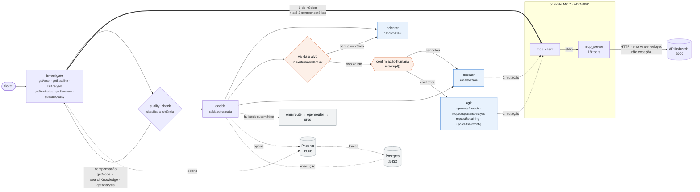

# Agente Industrial de Suporte — Challenge TRACTIAN × Inteli

Um agente que recebe um chamado de suporte sobre uma máquina monitorada e decide entre
**orientar**, **agir na plataforma** ou **escalar para um humano** — investigando uma API
industrial deliberadamente probabilística, onde o dado pode vir completo, parcial,
inconclusivo, em conflito entre fontes, ou simplesmente não vir.

O briefing original do parceiro está em [`STUDENT-GUIDE.md`](./STUDENT-GUIDE.md).

---

## Resultado

| conjunto | origem dos tickets | acertos | erros conservadores | erros arriscados |
| :--- | :--- | ---: | ---: | ---: |
| treino | parceiro | 9/13 — 69% | 4 | **0** |
| teste *held-out* | parceiro | 3/4 — 75% | 1 | **0** |
| cenários derivados | construídos aqui | 5/6 — 83% | 1 | **0** |

**Zero erros arriscados em 23 tickets** — e em 39 decisões, contando as três rodadas de
replicação. O agente erra, e erra sempre para o lado que não afirma nem altera nada sem
respaldo.

A acurácia no treino, replicada três vezes, é **9,3 ± 0,5 de 13**. A oscilação está
concentrada num único ticket de fronteira: 12 dos 13 dão a mesma decisão em todas as rodadas.

A **primeira versão que eu construí**, medida antes de qualquer auditoria, fazia **4 de 13
— 31%**, com dez dos treze tickets sendo escalados. O parceiro forneceu a API, os tickets e o
gabarito; a camada de agente — MCP, LangGraph, avaliação, observabilidade — é autoria própria. A trajetória completa das sete versões está em
[`docs/EVOLUCAO.md`](./docs/EVOLUCAO.md).

### Por que a versão entregue não é a de maior acurácia

Uma versão intermediária chegou a 85% no treino. Não é a que está aqui.

Num agente industrial os erros não custam igual: orientar errado sobre uma máquina em falha
custa mais que ocupar um engenheiro com um caso que daria para resolver remotamente. A
escada de consequência vai de `escalate` (não afirma nem altera nada) a `orient` (faz uma
afirmação técnica) a `act` (altera estado na plataforma). Errar para cima é **arriscado**;
para baixo, **conservador**.

A versão de 85% orientou um cliente cuja máquina **já havia quebrado**, com cinco categorias
de dado vazias. A versão entregue acerta menos e nunca erra desse jeito.

---

## Arquitetura



Os nós do grafo **não conhecem URL**: pedem uma tool pelo nome e a camada MCP resolve.

A seta grossa é o volume real: **a investigação é a maior consumidora do MCP** — 6 tools de
leitura na primeira passada, mais até 3 compensatórias. `agir` e `escalar` usam uma tool cada.

Em laranja, os três guarda-corpos antes de qualquer mutação: **o alvo é validado** contra os
ids que apareceram na evidência (sem alvo, a ação vira orientação), **um humano confirma**, e
**erro HTTP volta como envelope** — um 403 por falta de permissão é resposta legítima da API,
não exceção. `escalar` não passa por confirmação: é a ação segura.

Três decisões que governam o comportamento:

- **O `quality_check` anota, não bloqueia.** `conflict` devolve o payload íntegro mais um
  flag e `partial` só omite campos secundários — os dois continuam decidíveis. Só
  `inconclusive` e `unavailable` esvaziam o dado. Quem decide é o LLM, ciente das lacunas.
- **Evidência compensatória, nunca *retry*.** `resolve_mode` na API é um hash determinístico:
  repetir o mesmo GET devolve exatamente o mesmo envelope. Quando um dado falha, o agente
  busca *outro* endpoint que responda à mesma pergunta.
- **A camada MCP é a única interface com a API** ([ADR-0001](./docs/adr/ADR-0001-mcp-as-interface.md)).
  Os nós do grafo não conhecem URL: pedem uma tool pelo nome.

### Stack

LangGraph (orquestração) · MCP sobre stdio (18 tools) · Phoenix + OpenTelemetry
(observabilidade) · Postgres (log de execuções) · Streamlit (demonstração) · Pydantic
(saída estruturada).

Todos os LLMs vêm de **APIs gratuitas**, encadeadas com *fallback* automático entre
provedores — a cota diária de um deles estourou no meio de uma avaliação e derrubou cinco
de treze tickets.

---

## Avaliação

Duas dimensões, porque nenhuma basta sozinha:

- **Determinística** — decisão contra o gabarito (peso 2 de 4), cobertura de chamadas à API,
  e coerência entre o veredicto de qualidade e as lacunas registradas.
- **Juiz LLM** — honestidade, clareza, fundamentação e segurança, com âncoras de calibração
  para a nota não colapsar no meio da escala.

O caso que prova a necessidade das duas: num ticket o agente **acertou a decisão** e o juiz
deu 3. Em outro, o juiz deu nota alta a uma resposta que decidiu errado — era honesta e bem
escrita, só não deveria ter sido dada.

### Avaliando o próprio avaliador

Rodamos o mesmo agente com dois juízes de famílias diferentes, com as decisões congeladas em
cache — **13 de 13 idênticas**, só o avaliador mudou:

| eixo | juiz Sonnet 4.5 | juiz Gemini 3.6 | delta |
| :--- | ---: | ---: | ---: |
| nota geral | 6,92 | 6,77 | −0,15 |
| **honestidade** | **7,62** | **5,62** | **−2,00** |
| clareza | 7,31 | 8,54 | +1,23 |

A nota agregada quase não se moveu; honestidade caiu dois pontos. Viés de autoavaliação não é
inflação uniforme — concentra-se no eixo em que juiz e agente compartilham o ponto cego.

### Separação de conjuntos

| conjunto | arquivo | regra |
| :--- | :--- | :--- |
| treino | `eval/split.json` → `train` | 13 tickets, usados no desenvolvimento |
| teste | `eval/split.json` → `test` | 4 tickets *held-out*, rodados **uma vez só** no fim |
| derivados | `eval/expected-paths-derivados.json` | 6 cenários construídos aqui, reportados **à parte** |

> Os derivados ficam em arquivo separado de propósito: um gabarito escrito por quem também
> escreveu o agente pode favorecê-lo sem intenção. Cada entrada carrega um campo `derivacao`
> explicando de que regra o rótulo saiu, para ser auditável. Os dois conjuntos **nunca** devem
> ser somados num número só.

---

## Como rodar

Precisa de **Python 3.11 ou 3.12** (o `make setup` baixa a versão certa via `uv`) e
**Docker Desktop** para a observabilidade.

```bash
make setup      # venv na raiz + dependências (agente e API) + dados sintéticos
make up         # API industrial em :8000 — Swagger em /docs
make up-obs     # Postgres :5432 + Phoenix :6006, com a tabela de execuções
make ui         # console Streamlit em :8501
```

Configure `agent/.env` a partir de [`agent/.env.example`](./agent/.env.example) — pelo menos
`OPENAI_API_KEY`, `OPENAI_BASE_URL` e `OPENAI_MODEL`, mais `PHOENIX_ENABLED=1` para o tracing.

### Avaliação

```bash
make eval           # treino, sem juiz — rápido, para desenvolvimento
make run            # treino, com juiz LLM
make derivados      # os 6 cenários derivados, reportados à parte
make prova-final    # o teste held-out — uma vez só, no fim
make evolucao       # tabela de evolução entre versões
```

Medição de custo e latência exige desligar o cache de decisões, senão não há chamada de LLM
para medir:

```bash
.venv\Scripts\python.exe -m eval.runner --split train --no-cache
```

### Testes

```bash
.venv\Scripts\python.exe -m pytest tests/ -q     # 73 testes do agente, sem LLM
make test                                        # 39 testes da API industrial
```

---

## Onde está a evidência

| o quê | onde |
| :--- | :--- |
| Trajetória das sete versões, com ressalvas | [`docs/EVOLUCAO.md`](./docs/EVOLUCAO.md) |
| Decisão sobre a camada MCP, com histórico | [`docs/adr/`](./docs/adr/) |
| Glossário do domínio | [`CONTEXT.md`](./CONTEXT.md) |
| Guia de comandos | [`COMMANDS.md`](./COMMANDS.md) · [`QUICKSTART.md`](./QUICKSTART.md) |
| Onde cada processo mora no código | [`docs/MAPA-DO-CODIGO.md`](./docs/MAPA-DO-CODIGO.md) |
| Notas de estudo e decisões | [`Extra/Obsidian/Tractian Project/`](./Extra/Obsidian/) |

---

## Limitações conhecidas

- **Amostra pequena.** 13 tickets de treino, 4 de teste, 6 derivados. Cada caso do teste vale
  25 pontos percentuais — os números são indicativos, não estatisticamente significativos.
- **O 2×2 do juiz ficou incompleto.** Medimos dois juízes sobre o mesmo agente, mas isolar
  viés de autoavaliação com rigor exigiria também o modelo do juiz *escrevendo* e o outro
  julgando. Parte do delta pode ser diferença de calibração entre os modelos.
- **`temperature=0.3`** produz oscilação de um caso entre execuções idênticas — medida em
  três rodadas. As versões anteriores à v7 têm números de rodada única.
- **O conjunto de teste foi consumido.** Qualquer ajuste feito olhando aqueles 4 tickets os
  transformaria em treino.

---

## Conceitos de domínio

- **Baseline** — o "normal" aprendido do **próprio ativo**, a partir do histórico sadio dele.
  Ciclo: `learning → established → invalidated`. O limiar de alarme de RMS **deriva do
  baseline**, não de norma ISO nem de tabela por classe de máquina.
- **Modos de detecção** — `baseline` (desvio do aprendido: desbalanceamento, desalinhamento,
  rolamento, elétrica) exige baseline `established`; `symptom` (lubrificação) independe dele,
  porque o sintoma já indica a falha.
- **Insight / análise** — diagnóstico automático do modelo, com tipo, severidade, confiança,
  evidência, limitações e `detection_mode`.
- **Envelope de resposta** — toda consulta volta com um modo: `complete`, `partial`,
  `inconclusive`, `conflict` ou `unavailable`. **O agente decide** o que fazer com cada um.
- **Qualidade e frescor dos dados** — completude, relação sinal-ruído e atualidade. Afetam a
  confiabilidade do baseline e a capacidade do modelo de inferir.

## Escala do material

8 empresas · 26 ativos · 24 análises · 17 chamados originais · 6 cenários derivados.
